# UI-UX-Experiment3
# NAME: SHANMUGAKARTHIK G
# REG.NO: 212223220105
## Aim:
  To perform a heuristic evaluation of an existingwebsite or app, compare and analyze the user experience (UX) of 2–3 competing apps or websites, and develop and incorporate required changes based on the analysis.
## Algorithm:
1. Select the primary website or app to evaluate.

2. Identify 2–3 competing websites/apps for comparison.

3. Define heuristics for evaluation (e.g., usability, consistency, feedback, error prevention).

4. Evaluate each competing site/app against the heuristics.

5. Document strengths and weaknesses for each platform.

6. Summarize UX differences with examples and screenshots.

7. Propose UX improvements for the primary site/app based on findings.

8. Implement and test suggested changes.
## Output:

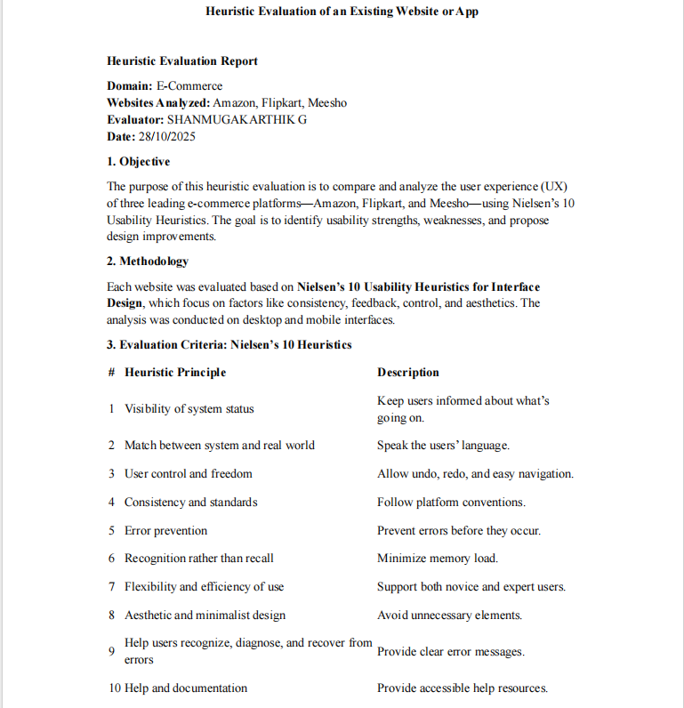
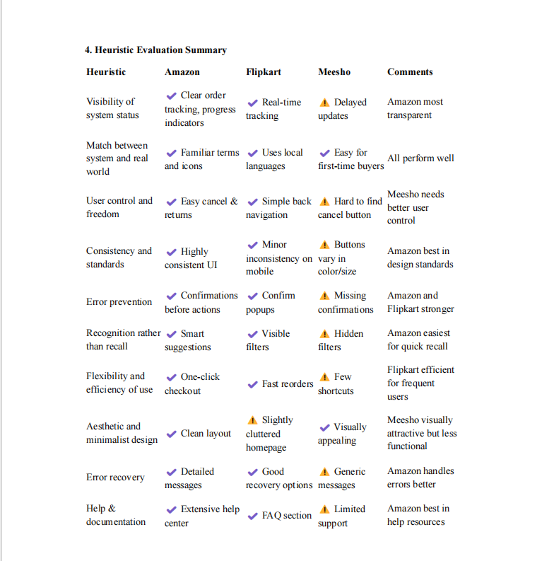
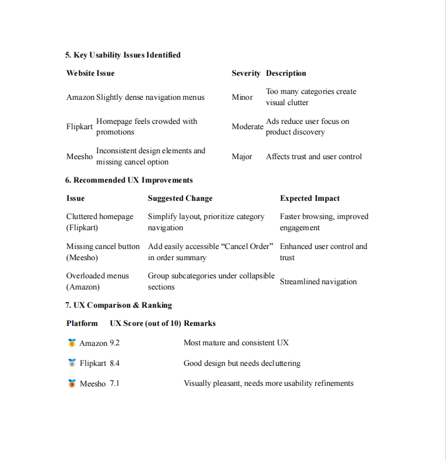
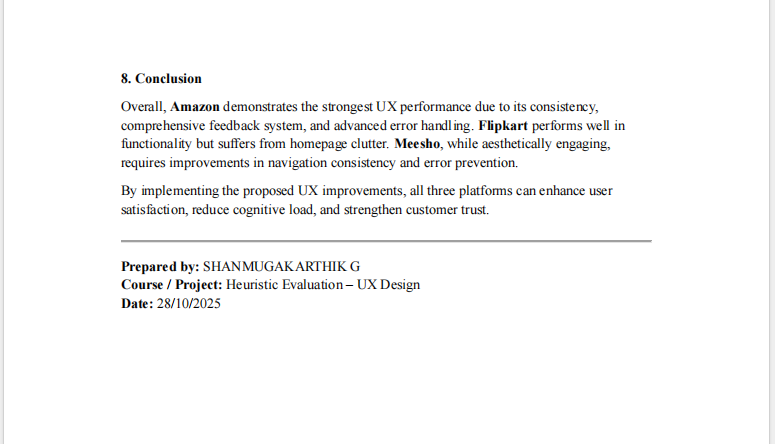
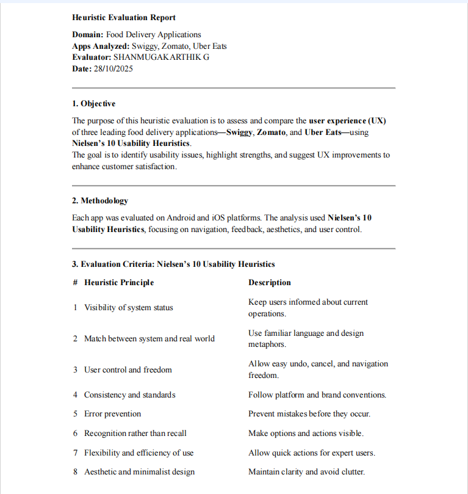
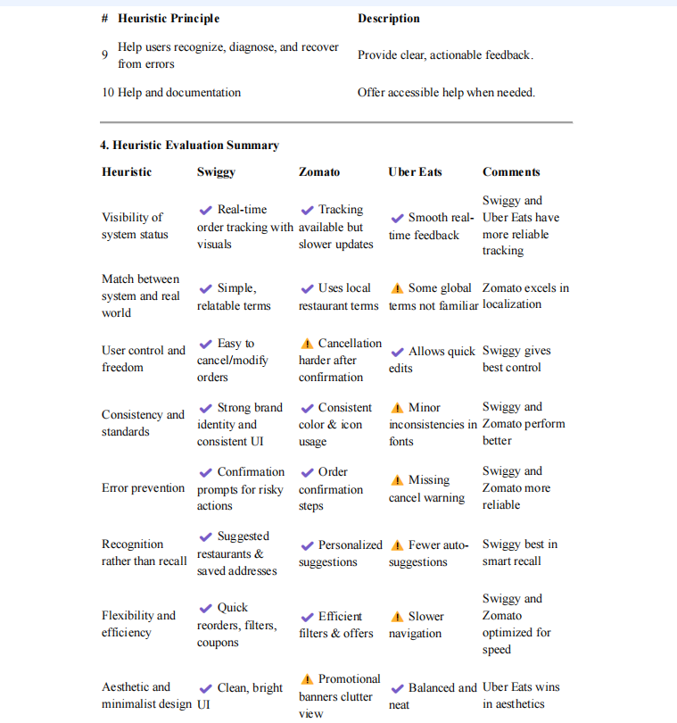
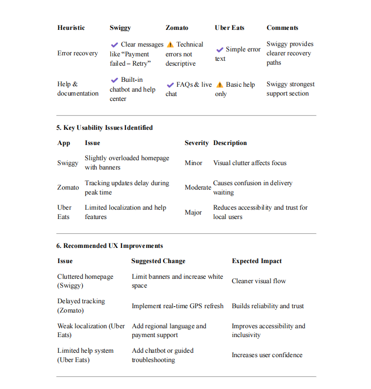
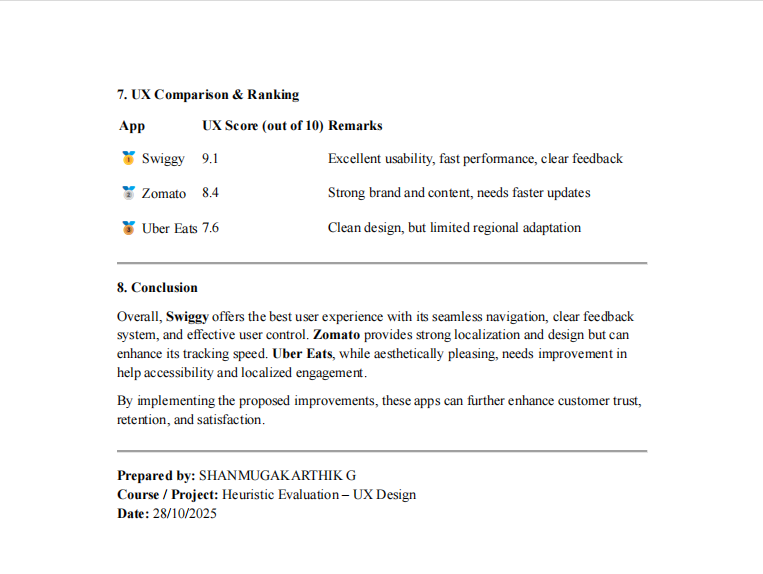
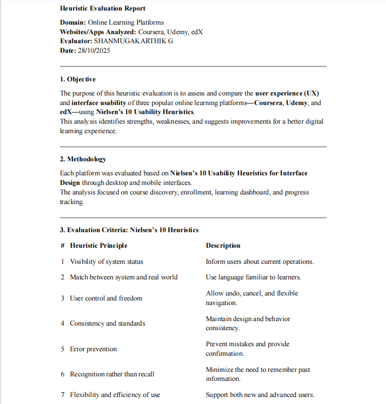
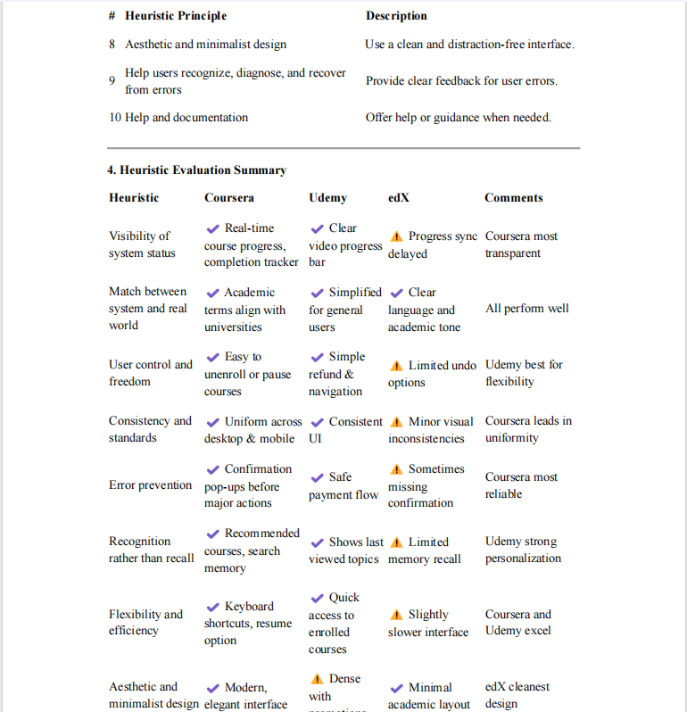
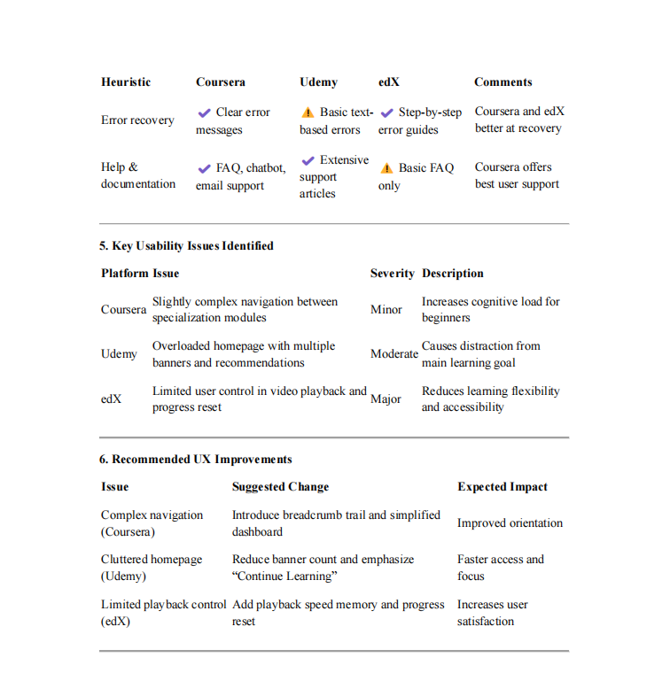
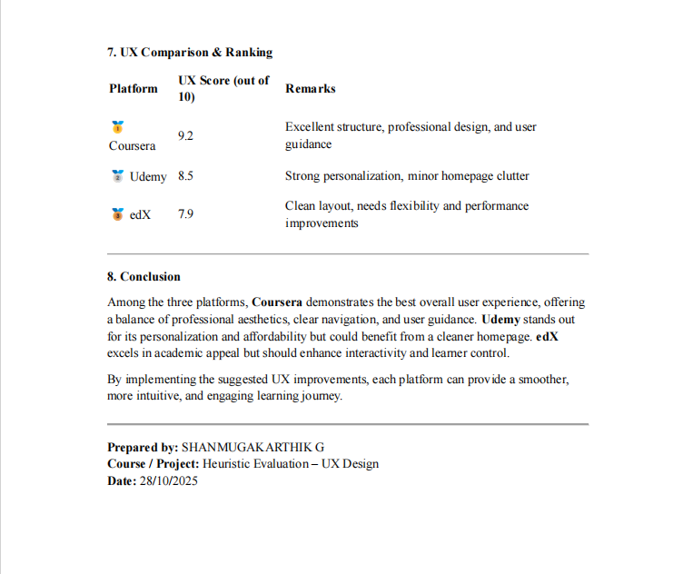
## Result:
UX enhancements made based on the analysis provided a more intuitive and effective experience for users.